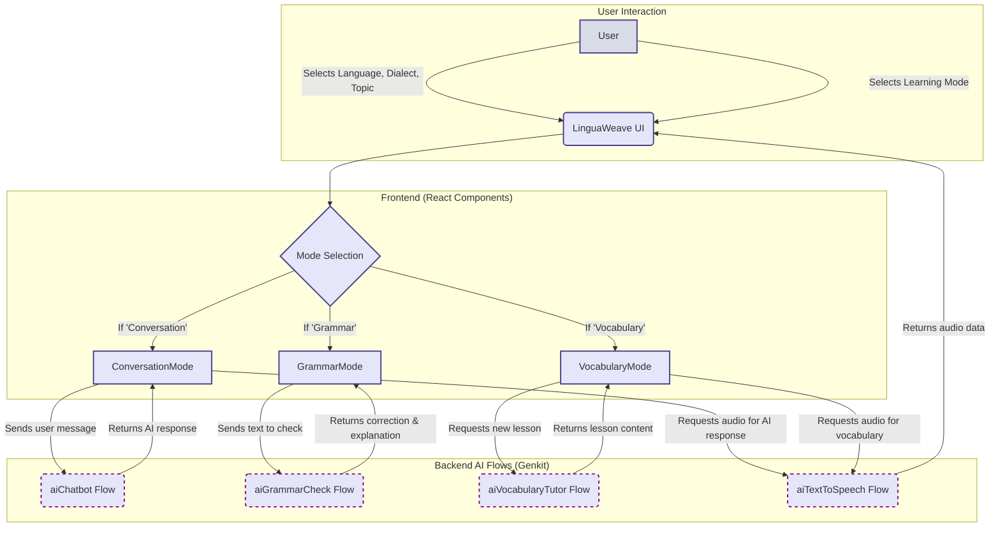
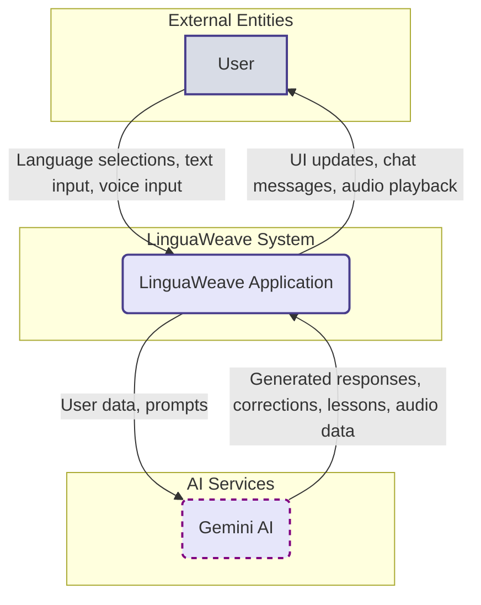
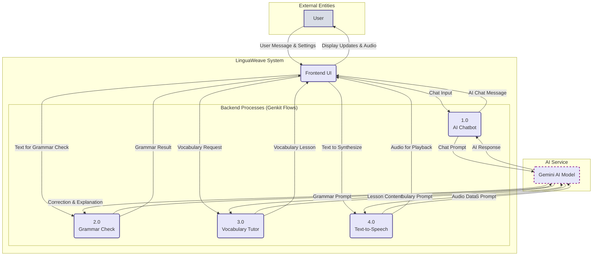

# LinguaWeave

LinguaWeave is an AI-powered language learning companion designed to help users improve their skills in a new language through conversation, grammar correction, and vocabulary building.

## Problem Being Solved

Learning a new language often presents several challenges: a lack of opportunities for real-world conversation practice, the fear of making mistakes in front of native speakers, and difficulty finding contextual examples for new vocabulary. LinguaWeave addresses these issues by providing a safe and interactive environment where learners can practice at their own pace. It acts as a patient, always-available tutor that offers instant feedback and guidance without judgment.

## How the Agent Works

LinguaWeave's intelligence is powered by Google's Gemini model, orchestrated using the Genkit framework. The application is structured around several specialized AI "flows" that handle different tasks:

*   **Conversation Practice (`ai-chatbot.ts`)**: This flow drives the interactive chat. It takes the user's message, the selected language, dialect, and topic as input. The AI then generates a relevant response in the target language, corrects any user mistakes, and keeps the conversation flowing naturally.
*   **Grammar Check (`ai-grammar-check.ts`)**: When a user submits a sentence for review, this flow analyzes the text for grammatical errors. It provides a corrected version of the sentence and a clear, easy-to-understand explanation of the rules that were violated.
*   **Vocabulary Tutor (`ai-vocabulary-tutor.ts`)**: This flow generates personalized vocabulary lessons. Based on the chosen topic, it introduces new words, provides example sentences to show them in context, and creates simple reinforcement exercises to help solidify the learning.
*   **Text-to-Speech (`ai-text-to-speech.ts`)**: To aid with listening comprehension and pronunciation, this flow converts the AI's text responses into audible speech. It uses a text-to-speech model to generate high-quality audio that the user can play back.
*   **Speech-to-Text**: On the user's side, the browser's built-in Web Speech API is used to capture the user's voice, transcribe it into text, and send it to the chatbot, enabling hands-free conversation practice.

These flows are called from the Next.js front-end, which is built with React and ShadCN UI components, to create a seamless and dynamic user experience.

## Potential Expansion: Role-Playing Scenarios

A powerful way to expand LinguaWeave would be to introduce a **Role-Playing Mode**. In this mode, the user could choose from various real-life scenarios, such as "Ordering food at a restaurant," "Booking a hotel room," or "Asking for directions."

The AI would act as the other character in the scenario (e.g., the waiter, hotel receptionist, or a local stranger), guiding the user through the conversation. This would provide highly contextual and practical language practice, helping users build confidence for real-world interactions. This could be implemented by creating a new AI flow that is prompted with the specific role-playing context and objectives.

## Diagrams

### Flow Diagram

This diagram illustrates the overall user flow and component interaction within the application.



### Sequence Diagram (Conversation Mode)

This diagram shows the sequence of interactions when a user sends a message in Conversation Mode.

```mermaid
sequenceDiagram
    actor User
    participant Browser as React UI
    participant Server as Next.js Server Action
    participant AI as Genkit/Gemini AI

    User->>Browser: Types message and clicks "Send"
    Browser->>Server: Calls aiChatbot({ language, topic, userMessage })
    activate Server
    Server->>AI: Executes aiChatbotFlow with prompt
    activate AI
    AI-->>Server: Returns AI response text
    deactivate AI
    Server-->>Browser: Returns { aiResponse: "..." }
    deactivate Server
    Browser->>Browser: Updates state with new message
    Browser->>User: Displays AI response in chat

    alt User clicks "Play Audio"
        Browser->>Server: Calls aiTextToSpeech({ text: aiResponse })
        activate Server
        Server->>AI: Executes aiTextToSpeechFlow
        activate AI
        AI-->>Server: Returns audio data
        deactivate AI
        Server-->>Browser: Returns { audio: "data:audio/wav;base64,..." }
        deactivate Server
        Browser->>User: Plays audio of the response
    end
```

### Data Flow Diagram (Level 0)

This diagram provides a high-level overview of how data moves through the LinguaWeave system.



### Data Flow Diagram (Level 1)

This diagram breaks down the main process into smaller sub-processes to show internal data flow in more detail.



## Getting Started

1.  **Install dependencies**:
    ```bash
    npm install
    ```

2.  **Run the development server**:
    ```bash
    npm run dev
    ```

Open [http://localhost:9002](http://localhost:9002) with your browser to see the result.

## Technology Stack

*   **Framework**: [Next.js](https://nextjs.org/)
*   **AI**: [Google's Gemini model via Genkit](https://firebase.google.com/docs/genkit)
*   **UI**: [React](https://react.dev/), [ShadCN](https://ui.shadcn.com/), [Tailwind CSS](https://tailwindcss.com/)
*   **Language**: [TypeScript](https://www.typescriptlang.org/)
